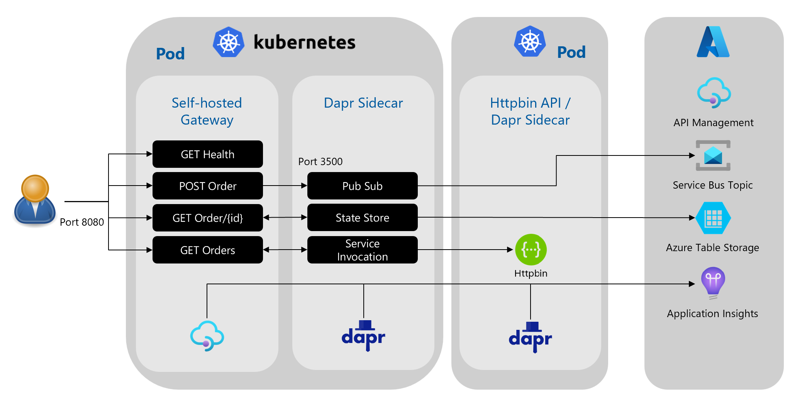
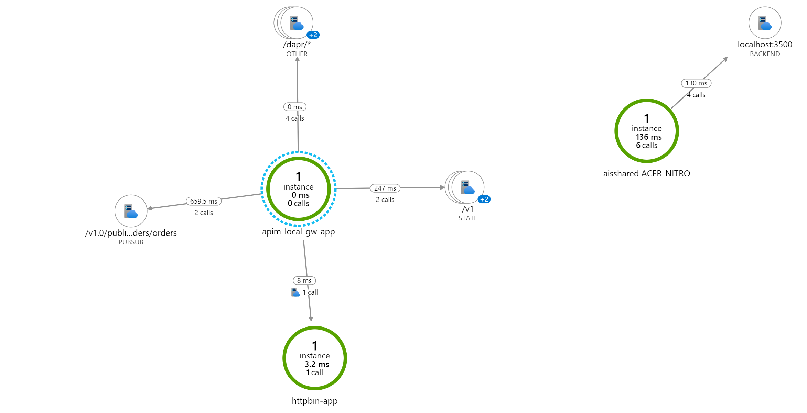

# ais-dapr-apim
This repo contains the technical instructions to complete an end-to-end scenario for using Dapr with Azure API Management Self-Hosted Gateway and Distributed Tracing via Application Insights.

I came across this [blog](https://yourazurecoach.com/2020/09/22/azure-api-management-integration-with-dapr/) and I really liked the samples in this blog. I extended this solution with tracing in Application Insights. Kudo's for Toon who wrote this blogpost!

## Architecture


## Prerequisites
* Install Minikube to run Kubernetes locally [Minikube](https://minikube.sigs.k8s.io/docs/start/)
* Install Visual Studio Code [Visual Studio Code](https://code.visualstudio.com/download)
* Install the [REST Client extension](https://marketplace.visualstudio.com/items?itemName=humao.rest-client) for Visual Studio Code
* Install Chocolatey (PowerShell)
```
Chocolatey (Set-ExecutionPolicy Bypass -Scope Process -Force; [System.Net.ServicePointManager]::SecurityProtocol = [System.Net.ServicePointManager]::SecurityProtocol -bor 3072; iex ((New-Object System.Net.WebClient).DownloadString('https://community.chocolatey.org/install.ps1’)))
```
* Install Dapr
```
Dapr (wget -q https://raw.githubusercontent.com/dapr/cli/master/install/install.sh -O - | /bin/bash)
```
* Install Gsudo (Easy Admin Priv switch in PowerShell) 
```
choco install gsudo
```
* Install Kubectl
```
choco install kubernetes-cli
```
* Install Curl (Optional: alternative for the Rest Client Extension)
```
choco install curl
```
* Install Azure CLI
```
choco install azure-cli
```

## Clone this repo
```
git clone https://github.com/pascalvanderheiden/ais-dapr-apim
```

## Setup local environment
* Start Minikube (initialize Kubernetes cluster locally)
```
minikube start
```
* Install Dapr on cluster
```
dapr init -k
```

## Setup Azure resources
These resources in Azure are needed for testing Dapr integration with them

* Log into Azure CLI and follow the instructions
```
az login
```
* Create an Azure resource group
```
$RESOURCE_GROUP_NAME=<YOUR_RESOURCE_GROUP_NAM>
az group create --name $RESOURCE_GROUP_NAME --location westeurope
```
* Create an Azure API Management instance
> If you have already an existing API Management instance (*Developer or Premium tier*), you can also use that one, as the provisioning of an API Management instance takes between 15 and 30 minutes
```
$APIM_NAME=<YOUR_UNIQUE_APIM_NAME>
az apim create --name $APIM_NAME --resource-group $RESOURCE_GROUP_NAME --location westeurope --publisher-email user@example.com --publisher-name Example
```
* Choose a unique Azure storage account name
```
$STORAGE_ACCOUNT_NAME=<YOUR_UNIQUE_STORAGE_ACCOUNT_NAME>
```
* Create an Azure storage account.  This will be used as a Dapr statestore
```
az storage account create --name $STORAGE_ACCOUNT_NAME --resource-group $RESOURCE_GROUP_NAME
```
* Set storage account key variable
```
$STORAGE_ACCOUNT_KEY=$(az storage account keys list --account-name $STORAGE_ACCOUNT_NAME% --query [0].value --output tsv')
echo $STORAGE_ACCOUNT_KEY
```
* Create Table Queue in Storage Account
```
az storage table create --name orders --account-key $STORAGE_ACCOUNT_KEY --account-name $STORAGE_ACCOUNT_NAME
```
* Choose a unique Azure Service Bus namespace name
```
$SERVICE_BUS_NAMESPACE_NAME=<YOUR_UNIQUE_SERVICE_BUS_NAMESPACE_NAME>
```
* Create an Azure Service Bus namespace.  This will be used for testing Dapr publish/subscribe.
```
az servicebus namespace create --name $SERVICE_BUS_NAMESPACE_NAME --resource-group $RESOURCE_GROUP_NAME%
```
* Create an Azure Service Bus topic, named *orders*.
```
az servicebus topic create --name orders --namespace-name $SERVICE_BUS_NAMESPACE_NAME --resource-group $RESOURCE_GROUP_NAME
```
* Create a subscription for this topic, named order-processing
```
az servicebus topic subscription create --resource-group $RESOURCE_GROUP_NAME --namespace-name $SERVICE_BUS_NAMESPACE_NAME --topic-name orders --name order-processing
```
* Set the service bus connection string
> :warning: for production usage, I highly recommend to create an application specific authorization rule
```
SERVICE_BUS_CONNECTION_STRING=$(az servicebus namespace authorization-rule keys list --name RootManageSharedAccessKey --namespace-name $SERVICE_BUS_NAMESPACE_NAME --resource-group $RESOURCE_GROUP_NAME --query primaryConnectionString --output tsv')
ECHO $SERVICE_BUS_CONNECTION_STRING
```
* Create Application Insights resource
```
$APPINSIGHTS_NAME=<YOUR_APPINSIGHTS_NAME>
az monitor app-insights component create --app $APPINSIGHTS_NAME --location westeurope -g $RESOURCE_GROUP_NAME
SET APPINSIGHTS_KEY=$(az resource show --name $APPINSIGHTS_NAME -g $RESOURCE_GROUP_NAME --resource-type 'microsoft.insights/components' -o tsv --query properties.InstrumentationKey)
ECHO $APPINSIGHTS_KEY
```
* You can use use API Management natively with Application Insights, just follow this link:
https://docs.microsoft.com/en-us/azure/api-management/api-management-howto-app-insights

## Create API Gateway
* Open your existing API Management instance - or create a new one
* Go to *Gateways* and add a new Gateway `apim-local-gw`
* In the *Deployment* tab, choose `Kubernetes` and copy the contents of the YAML file
* Update the placeholder file in repository, past the YAML Contents from the Portal in here:
```
code . requests/apim-local-gw.yaml
```
* Add the Dapr annotation to the YAML file (leave the "tracing" commented, we will update this later)
```yaml
kind: Deployment
spec:
  template:
    metadata:
      annotations:
        dapr.io/enabled: "true"
        dapr.io/app-id: "apim-local-gw-app"
        dapr.io/app-port: "3500"
#        dapr.io/config: "tracing"
```

## Apply the changes and deploy the API Gateway
```
kubectl create secret generic xxx --from-literal=value="xxx" --type=Opaque
kubectl apply -f requests/apim-local-gw.yaml
```
* Check if the pod, with 2 Containers is successfully deployed
```
kubectl get pods
kubectl describe pod <POD_NAME>
```
## Add Distributed Tracing with Application Insights
I'm using the [OpenTelemetry Collector](https://github.com/open-telemetry/opentelemetry-collector), as it is a vendor agnostics implementation on how to receive, process and export telemetry data.
 
* Edit the YAML file, and change the Application Insights Instrumentation Key.
```
code . config/open-telemetry-collector-appinsights.yaml
```
```yaml
azuremonitor:
    endpoint: "https://dc.services.visualstudio.com/v2/track"
    instrumentation_key: "<YOUR_APPINSIGHTS_KEY>"
```
* Apply the changes
```
kubectl apply -f config/open-telemetry-collector-appinsights.yaml
kubectl apply -f config/collector-config.yaml
```
* Update the API Gateway Deployment with tracing
```
code . requests/apim-local-gw.yaml
```
```yaml
kind: Deployment
spec:
  template:
    metadata:
      annotations:
        dapr.io/config: "tracing"
```
* Apply the Changes
```
kubectl apply -f requests/apim-local-gw.yaml
```

## Lets create some API's now!

## Get Health (/health)
* Create API in Azure Portal, connect it to the Local Gateway and update the Policy 
```xml
    <inbound>
        <base />
        <return-response>
            <set-status code="200" />
            <set-body>@("All is okay. Cheers from " + context.Deployment.Region)</set-body>
        </return-response>
    </inbound>
```
* Use port forwarding for easy testing 
```
kubectl port-forward service/apim-local-gw 8080:80 8081:443
```
* Use the Test Script in this file
```
code . requests/tests.http
```

## Post Order (/order) policy (Dapr PubSub)
* Create API in Azure Portal, connect it to the Local Gateway and update the Policy 
```xml
    <inbound>
        <base />
        <publish-to-dapr topic="@("pub-sub-orders/orders")" timeout="10" ignore-error="false" template="liquid">{{body}}</publish-to-dapr>
        <return-response>
            <set-status code="200" />
            <set-body>@("Message send to Service Bus.")</set-body>
        </return-response>
    </inbound>
```
* Update the YAML File with the Service Bus Connection String
```
code . components/pub-sub-orders.yaml
```
```yaml
spec:
  metadata:
  - name: connectionString
    value: <SERVICE_BUS_CONNECTIONSTRING>
```
* Apply the Changes
```
kubectl apply -f components/pub-sub-orders.yaml
```
* Check if the component is present
```
kubectl get components
```
* EDIT: For some reason the component gave an error, but after I restarted the deployments everything was running fine
```
kubectl rollout restart deployments/apim-local-gw
```
* Use port forwarding for easy testing 
```
kubectl port-forward service/apim-local-gw 8080:80 8081:443
```
* Use the Test Script in this file
```
code . requests/tests.http
```
* Check the message in Service Bus in the Azure Portal

## Get Orders (/order) policy (Dapr Service Invocation)
* Create API in Azure Portal, connect it to the Local Gateway and update the Policy 
```xml
    <inbound>
        <base />
        <set-backend-service backend-id="dapr" dapr-app-id="httpbin-app" dapr-method="get" />
        <set-header name="x-dapr-test" exists-action="override">
            <value>request-header</value>
        </set-header>
    </inbound>
```
* Deploy HttpBin Echo API service & Dapr Sidecar in a pod
```
kubectl apply -f services/httpbin-app.yaml
```
* Use port forwarding for easy testing 
```
kubectl port-forward service/apim-local-gw 8080:80 8081:443
```
* Use the Test Script in this file
```
code . requests/tests.http
```

## Get Order (/order/{id}) policy (Dapr state-store)
* Create API in Azure Portal, connect it to the Local Gateway and update the Policy 
```xml
    <inbound>
        <base />
        <set-backend-service base-url="http://localhost:3500" />
        <rewrite-uri template="/v1.0/state/state-store-orders/{id}" copy-unmatched-params="true" />
    </inbound>
```
* Update the YAML File with Storage Account Name and Key
```
code . components/pub-sub-orders.yaml
```
```yaml
spec:
  metadata:
  - name: accountName
    value: <YOUR_STORAGE_ACCOUNT_NAME>
  - name: accountKey
    value: <YOUR_STORAGE_ACCOUNT_KEY>
```
* Apply the Changes
```
kubectl apply -f components/state-store-orders.yaml
```
* Check if the component is present
```
kubectl get components
```
* Use port forwarding to post 2 entries directly to the Dapr Sidecar
```
kubectl port-forward deployment/apim-local-gw 3500:3500
```
* Use the Prereq script to post some sample data into the Azure Table.
```
code . requests/prereq.http
```
* Use port forwarding for easy testing 
```
kubectl port-forward service/apim-local-gw 8080:80 8081:443
```
* Use the Test Script in this file
```
code . requests/tests.http
```

## Check out Application Insights for the Distributed Trace Logging
In the Azure Portal, go to your Application Insights and open the Application Map. Here you can see a visualisation of what call's you made on a container/component level. You can drilldown into the actual call's, and see what is happening on a detail level.



## Using Key Vault for the Azure Storage and Service Bus Queue
> When you are going to deploy this in production, please use Key Vault integration for storing your secrets.

## Want to use Zipkin instead of Application Insights
If you want to run you Distributed Tracing locally as well, you can deploy Zipkin and see your tracing from here.
Instead of deploying open-telemetry-collector, use these commands instead.

* Deploy Zipkin in a seperate container and expose port 9411, default for Zipkin
```
kubectl create deployment zipkin --image openzipkin/zipkin
kubectl expose deployment zipkin --type ClusterIP --port 9411
```
* Deploy Zipkin as a component in Dapr
```
kubectl apply -f components/zipkin-tracing.yaml
```
* Deploy this tracing config instead of `config/collector-config.yaml`
```
kubectl apply -f config/tracing.yaml
```
* Run port forwarding to start listening on port 9411
```
kubectl port-forward svc/zipkin 9411:9411
```
* Run the Zipkin Dashboard in your browser
```
start http://localhost:9411 
```